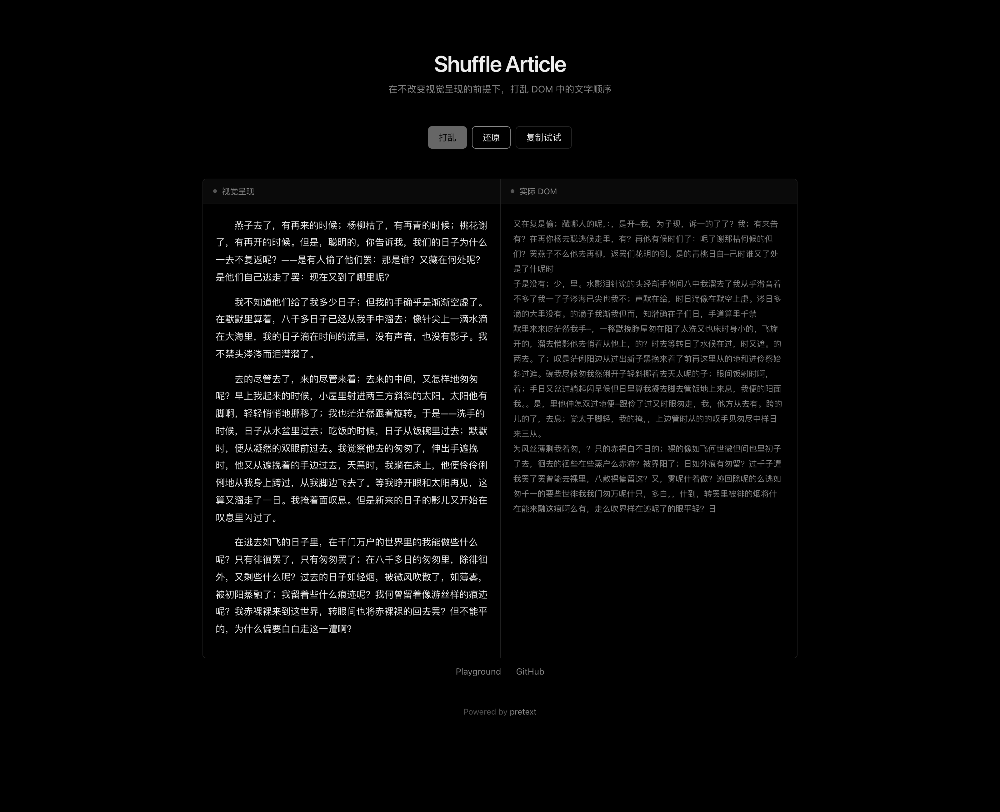
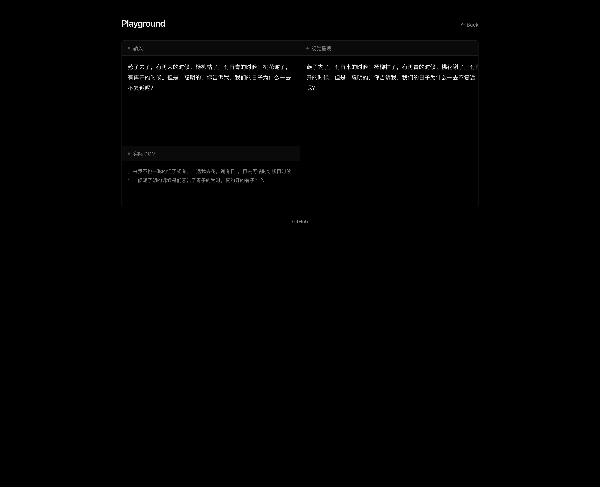

# Shuffle Article

Shuffle text in the DOM while preserving visual rendering for lightweight anti-copy protection.

在不改变视觉呈现的前提下，打乱 DOM 中的文本顺序，以降低直接复制文本的可用性。

## Published Packages

| Package | Version | npm | Package README |
| --- | --- | --- | --- |
| `article-shuffle` | `2.1.0` | <https://www.npmjs.com/package/article-shuffle> | [packages/core/README.md](./packages/core/README.md) |
| `react-article-shuffle` | `0.1.0` | <https://www.npmjs.com/package/react-article-shuffle> | [packages/react/README.md](./packages/react/README.md) |

## Packages

| Package | Name | Responsibility |
| --- | --- | --- |
| Core | `article-shuffle` | DOM APIs and pure layout utilities |
| React | `react-article-shuffle` | React component built on top of the core package |
| Demo | `@article-shuffle/demo` | Workspace demo app used for verification and screenshots |

## Workspace Layout

```text
shuffle-article/
  |
  +-- packages/core
  |     publishable core package
  |
  +-- packages/react
  |     publishable React package
  |
  +-- apps/demo
        Vite demo app consuming both packages
```

## Demo

| Page | Link | Purpose |
| --- | --- | --- |
| Main demo | <https://innei.github.io/shuffle-article/> | Current public demo entry; compare visual rendering with the actual DOM order |
| Playground | <https://innei.github.io/shuffle-article/playground> | Current public playground for testing arbitrary content |

## Screenshots

| Main demo | Playground |
| --- | --- |
|  |  |

## Install

| Use case | `pnpm` | `npm` |
| --- | --- | --- |
| Core package | `pnpm add article-shuffle` | `npm install article-shuffle` |
| React package | `pnpm add react-article-shuffle` | `npm install react-article-shuffle` |

## Core Usage

```ts
import { shuffleAll, shuffleElement } from 'article-shuffle'

const paragraph = document.querySelector('p')
if (paragraph) {
  shuffleElement(paragraph)
}

const article = document.querySelector('article')
if (article) {
  shuffleAll(article)
}
```

## React Usage

```tsx
import { ShuffleText } from 'react-article-shuffle'

export function ArticlePreview() {
  return (
    <ShuffleText
      blocks={[
        'The first paragraph stays visually readable.',
        'The copied result no longer follows the original reading order.',
      ]}
      className="article-preview"
      blockAs="p"
    />
  )
}
```

## API

| Package | API | Description |
| --- | --- | --- |
| `article-shuffle` | `shuffleElement(el)` | Shuffle one element in place while preserving its visual layout. |
| `article-shuffle` | `shuffleAll(root, options?)` | Shuffle all matching descendants inside a container. |
| `article-shuffle` | `createShuffledLayout(inputs, options)` | Produce reusable shuffled layout data for custom renderers. |
| `article-shuffle` | `createShuffleLayout(inputs, options)` | Legacy-compatible alias of `createShuffledLayout`. |
| `article-shuffle` | `process(el)` / `processAll(root, options?)` | Legacy aliases kept for compatibility. |
| `react-article-shuffle` | `ShuffleText` | React component that renders shuffled text blocks. |
| `react-article-shuffle` | `useShuffleLayout` | React hook for building custom shuffled text renderers. |

## Development

| Task | Command |
| --- | --- |
| Install dependencies | `pnpm install` |
| Start demo | `pnpm dev` |
| Type-check workspace | `pnpm check` |
| Run workspace tests | `pnpm test` |
| Build packages only | `pnpm build:packages` |
| Build demo only | `pnpm build:demo` |
| Run the full verification build | `pnpm build` |

## Documentation Model

```text
[Root README]
     |
     +--> repository overview
     +--> live demo links
     +--> workspace commands
     |
     +--> [packages/core/README.md]
     |        package-specific DOM API details
     |
     +--> [packages/react/README.md]
              package-specific React API details
```

- The root README is the repository-level index for the monorepo.
- Package-level installation and API details are maintained in the corresponding package READMEs so that npm pages remain focused and accurate.

## Vercel

| Deployment Mode | Config File | Build Command | Output Directory |
| --- | --- | --- | --- |
| Repository root as project root | `./vercel.json` | `pnpm vercel-build` | `apps/demo/dist` |
| `apps/demo` as project root | `./apps/demo/vercel.json` | `pnpm build` | `dist` |

- Both configurations include a rewrite to `index.html` so `BrowserRouter` routes such as `/playground` continue to work on direct refresh.

## How It Works

```text
[Input text blocks]
        |
        v
[Read typography and available width]
        |
        v
[Compute per-character positions]
  using @chenglou/pretext + canvas.measureText
        |
        v
[Wrap each character in an absolutely positioned span]
        |
        v
[Shuffle DOM order while keeping absolute positions]
        |
        v
[Visual layout stays stable, copied text becomes scrambled]
```

- The core package owns the layout algorithm and DOM helpers.
- The React package reuses the core package rather than reimplementing the algorithm.
- The demo app consumes both packages to validate the workspace package boundaries.

## License

MIT © [Innei](https://github.com/Innei)
